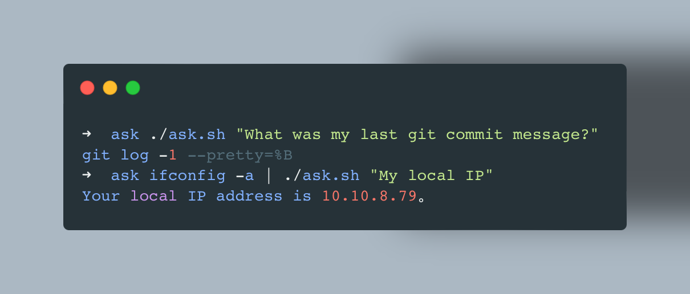

# **ask.sh**

Ask LLM directly from your terminal, and let the AI answer your terminal's output without leaving the terminal. Or generate shell commands you're not familiar with. A bash script will do the trick. You can even manually write plugins to let AI help you do more things.



## Install

This script is written in bash, Simply download the script and add execution permissions, this script relies on `curl` and `jq`, make sure they are installed on your system!

### Manual Install
```bash
curl https://raw.githubusercontent.com/TBXark/ask.sh/master/ask.sh > /usr/local/bin/ask
chmod +x /usr/local/bin/ask
```
### Install by npm
```bash
npm install -g ask.sh
```

## Supported LLMs
- All OpenAI Compatible LLMs API

## Configuration

### Config File
```bash
ask set-config answer_language chinese
ask set-config api_key sk-xxxx
ask set-config api_model deepseek-chat
ask set-config api_endpoint https://api.deepseek.com/chat/completions
ask set-config timeout 60
ask set-config debug false
```

You can also edit `~/.config/ask.sh/config.json` directly

### View Configuration
```bash
ask get-config api_key
ask get-config api_model
# View all available configuration keys
ask get-config
```

### Environment Variables
If you don't want to use a configuration file, you can set the configuration via environment variables.
```bash
export ASK_SH_API_KEY=xxx
export ASK_SH_API_MODEL=xxx
export ASK_SH_API_ENDPOINT=xxx
export ASK_SH_ANSWER_LANGUAGE=xxx
export ASK_SH_TIMEOUT=60
export ASK_SH_DEBUG=false
```

Or you can change configuration file path by setting `ASK_SH_CONFIG_FILE` environment variable

```bash
export ASK_SH_CONFIG_FILE=/path/to/config.json
export ASK_SH_CONFIG_DIR=/path/to/config/dir
```


## Usage

### Basic Commands
Generate Shell commands based on questions:
```bash
ask "What was my last git commit message?"
# Output:
# git log -1 --pretty=%B
```

Using command output as context:
```bash
ifconfig -a | ask "My local IP"
# Output:
# Your local IP address is `192.168.31.200`
```

### Debug Mode
Enable debug mode to see detailed request/response information:
```bash
ask --debug "How to list files?"
# Or set via environment
export ASK_SH_DEBUG=true
ask "How to list files?"
```

### Configuration Management
```bash
# Set configuration
ask set-config api_key sk-xxxx
ask set-config timeout 30

# View configuration
ask get-config api_key
ask get-config timeout

# View help
ask --help
ask --version
```

## Plugins

### Plugin Management
```bash
# Install a plugin
ask install-plugin https://raw.githubusercontent.com/TBXark/ask.sh/master/plugins/translate.sh

# List installed plugins  
ask list-plugins

# Use a plugin
ask -p translate "你好，世界" english
echo "Hello, World" | ask -p translate chinese
```

### Install Plugin
```bash
ask install-plugin https://raw.githubusercontent.com/TBXark/ask.sh/master/plugins/translate.sh
```
Or you can install the plugin manually in the `~/.config/ask.sh/plugins` directory

### Use Plugin
Usage: `ask -p PLUGIN_NAME [ARGS]` or `pipe | ask -p PLUGIN_NAME [ARGS]`
```bash
echo "你好，世界" | ask -p translate english
# Output:
# Hello, World
```

### Create Plugin
The plugin is a script file that implements the `gen_content` (required) and `after_ask` (optional) functions. The `gen_content` function is used to generate the context of the question, and the `after_ask` function is used to process AI's response.

In `after_ask`, you can do many things, such as writing the result to a file or directly executing the command returned by AI.

For details, please refer to [example](./plugins)

## Command Reference

### Basic Usage
```bash
ask "your question"                    # Ask a question
command | ask "explain this output"   # Use command output as context
ask --debug "question"                # Enable debug mode
ask --help                            # Show help
ask --version                         # Show version
```

### Configuration Commands
```bash
ask set-config <key> <value>          # Set configuration value
ask get-config <key>                  # Get configuration value
```

**Available configuration keys:**
- `api_key` - API key for LLM service
- `api_model` - Model name (default: gpt-5-nano)
- `api_endpoint` - API endpoint URL (default: OpenAI API)
- `answer_language` - Response language (default: english)
- `timeout` - Request timeout in seconds (default: 60)
- `debug` - Enable debug mode (default: false)

### Plugin Commands
```bash
ask install-plugin <url>              # Install plugin from URL
ask list-plugins                      # List installed plugins
ask -p <plugin_name> [args]           # Use a plugin
```

### Environment Variables
All configuration can be overridden using environment variables:
- `ASK_SH_API_KEY`
- `ASK_SH_API_MODEL`
- `ASK_SH_API_ENDPOINT`
- `ASK_SH_ANSWER_LANGUAGE`
- `ASK_SH_TIMEOUT`
- `ASK_SH_DEBUG`
- `ASK_SH_CONFIG_FILE` - Custom config file path
- `ASK_SH_CONFIG_DIR` - Custom config directory path


## Thanks
This project was inspired by the [egoist/shell-ask](https://github.com/egoist/shell-ask) project, but since it has a dependency on nodejs, I decided to rewrite it in bash

## License
**ask.sh** is released under the MIT license. See LICENSE for details.
